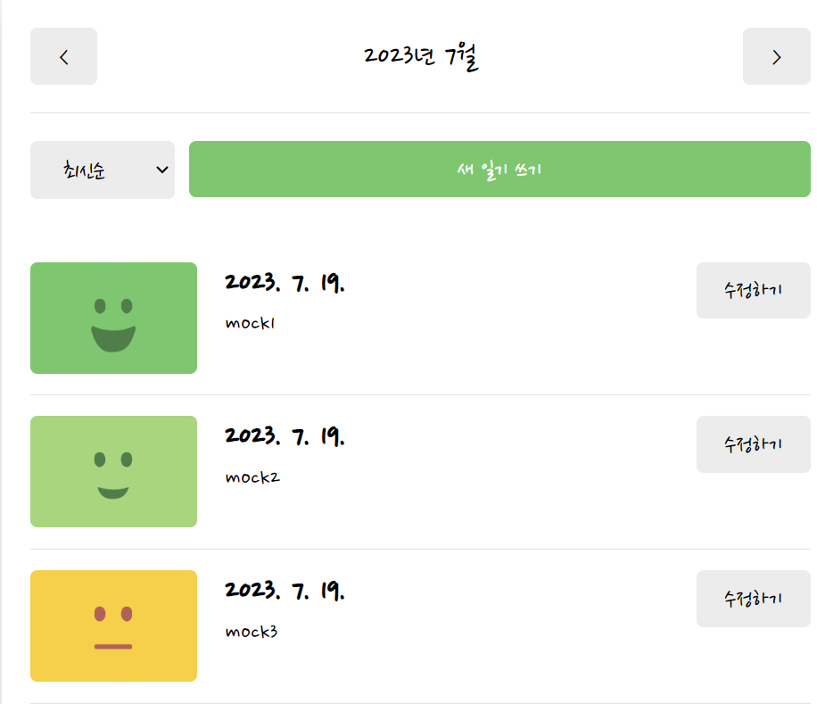
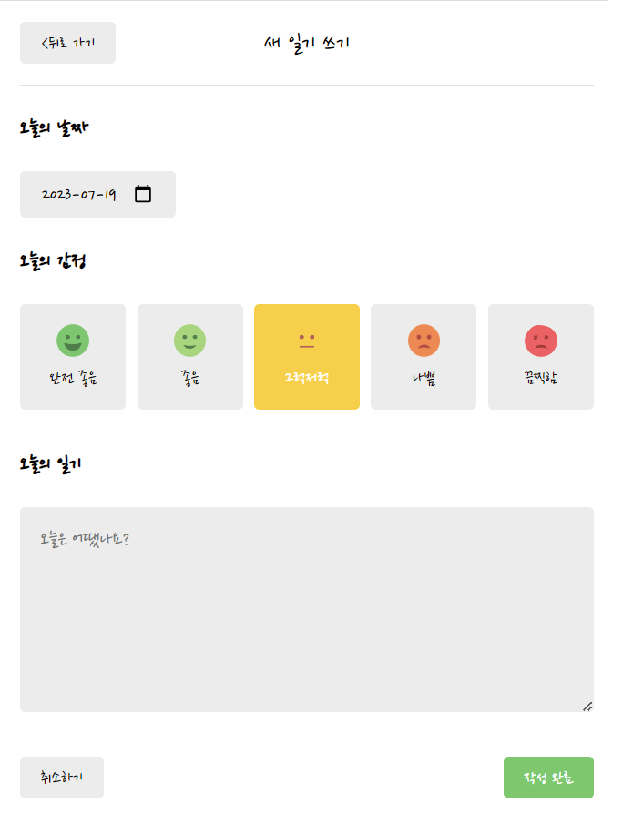
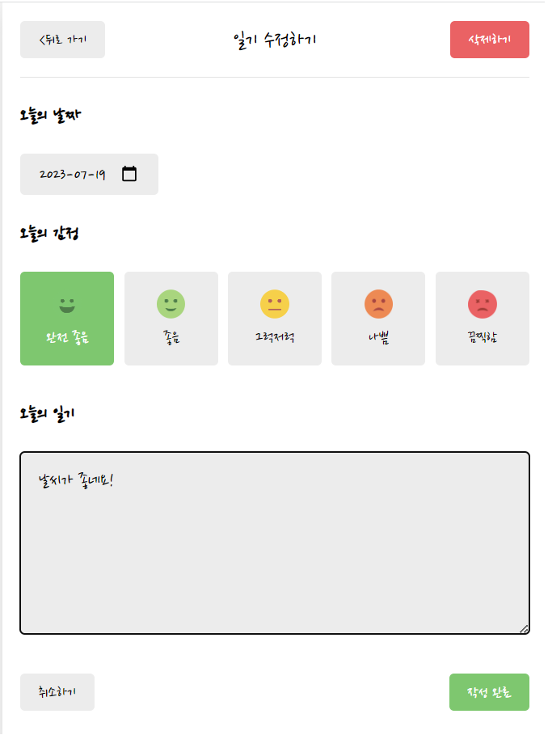
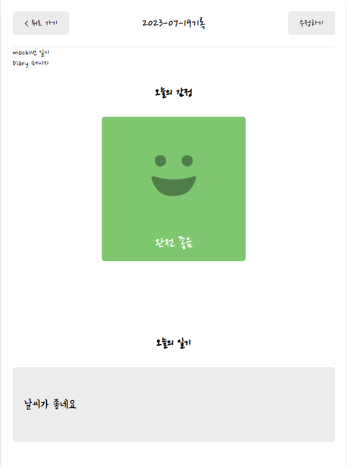

# 감정 일기장🍀


 
### 🧩 모듈 <br/>
```
> $ npm install
```


### 🧩 실행 <br/>
```
> $ npm run start
```

### 😎 메인페이지<br/>
   
   💡일기쓰기,수정하기,상세보기 기능,정렬기능,월별 조회기능 이벤트 선택이 가능합니다.
### 😎 작성페이지<br/>
   
   💡오늘의 감정을 이모티콘으로 선택, 날짜 지정을 할 수 있습니다.<br/>
   💡뒤로가기 버튼 클릭시 메인페이지로 이동 가능.
### 😎 수정페이지<br/>
   
   💡작성했던 일기내용 수정이 가능합니다.
### 😎 상세보기<br/>
   
   💡사용자가 작성했던 날짜와 감정이모티콘을 조회가 가능합니다.


### 📑 구현 기능

---

☑️ 새 일기 쓰기 기능
☑️ 일기장 상세조회 기능
☑️ 일기장 수정 기능
☑️ 일기장 삭제 기능
☑️ 정렬 기능


